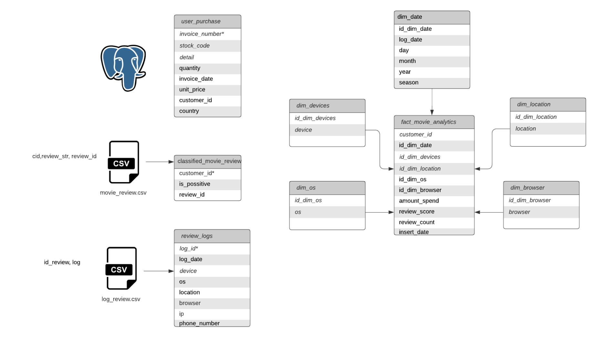
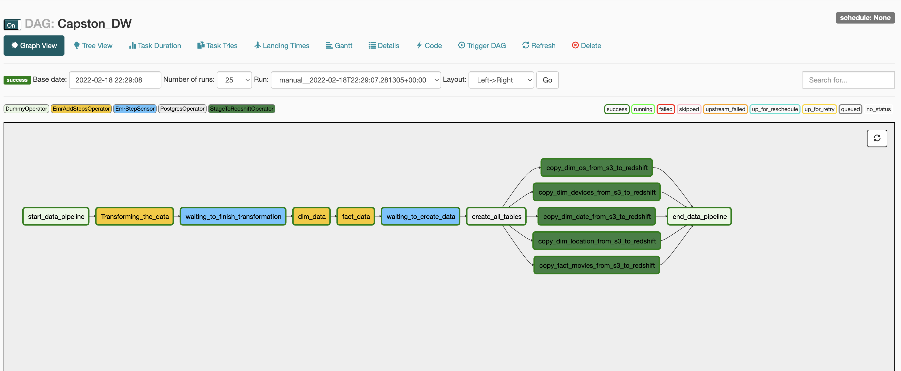

# Capston Proyect

### Problem Description

Assume that you work for a user behavior analytics company that collects user data and creates user profiles. You must build a data pipeline to populate the fact_movie_analytics table, this is an OLAP table. The data from fact_movie_analytics is useful for analysts and tools like dashboard software.

The table fact_movie_analytics takes information from:

* A PostgreSQL table named user_purchase. 

* Daily data by an external vendor in a CSV file named movie_review.csv that populates the classified_movie_review table. This file contains a customer id, review id and the message from the movie review. 

* Daily data by an external vendor in a CSV file named log_reviews.csv. This file contains the id review and the metadata about the session when the movie review was done like log date, device (mobile, computer), OS (windows, linux), region, browser, IP, phone number.

### Setup the environment

Use the Terraform template to accommodate the corresponding blocks in order to create the DW.

* EKS cluster

* S3 buckets

* EMR cluster

* Redshift cluster

Terraform Modules and instructions are located in aws folder. 

### Load the data

Use the storage resources S3 created with Terraform.

One bucket for Raw Layer and the other for Staging Layer.

* Upload movie_review.csv and log_reviews.csv files in Raw Layer.

* Upload python scripts files needed to process the data in Raw Layer.

* Upload packages.sh script in Raw Layer (Needed for Bootstrap actions in EMR)

### Process and data Transformation

- Read the PostgreSQL table and write the data in the Staging Layer (dag_s3_to_postgres).

- Read movie_review.csv from Raw Layer and write the result in the Staging Layer following the logic listed below. (Movie review logic).
- Read log_reviews.csv from Raw Layer and write the result in the Staging Layer following the logic listed below. (Log reviews logic).
- Use the EMR cluster created with Terrafomr to build dim tables and calculate fact_movie_analytics.

#### Movie review logic:

From the movie_review.csv file, work with the cid and review_str
columns to get a list of words used by users.

- Remove stop words if needed with pyspark.ml.feature.StopWordsRemover.
- Look for data that contain the word “good”, consider the review as positive, and name it as positive_review.
- Select the appropriate file format for the next steps.
- Use the following logic to convert positive_review from a boolean to an integer:

reviews.positive_review = CASE
WHEN positive_review IS True THEN 1
ELSE 0
END

- Save the data in the STAGE area. What you need is user_id, positive_review, review_id.

#### Log reviews logic:

- From the log_reviews.csv file, map the structure for the DataFrame schema according to the log_review column that contains the xml as a string.
- Work with the log column to get all the metadata and build the columns for your DataFrame.
- Don’t forget to drop the log column by the end.
- Store results into a new file in the STAGE area (log_id, log_date device, os, location, browser, ip, phone_number).

### Data Structure:

> Tables and their relationships

### Data Pipeline design: 

The pipeline does the following tasks:

1. Extract data from multiple S3 locations.
2. Transform the data using Movie review logic and Log reviews logic and pyspark in a EMR cluster.
3. Transform the data into a star schema building the dimention and fact tables.
4. Create all tables in Redshift cluster.
5. Load the data into Redshift tables.

> Structure of the Airflow DAG

### How to run this project?

##### Step 1: Create AWS infraestucture using Terraform modules (use aws folder in this repo)

